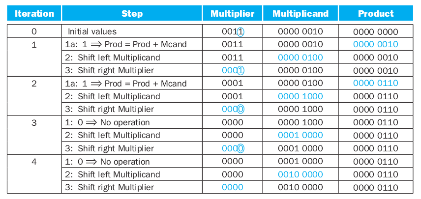

## Multiplicação

|||||||||||
|--|--|--|--|--|--|--|--|--|--|
|||||1 |0 |0 |0 | Multiplicando M|
||||x| 1| 0| 1| 1| Multiplicador Q|
|||||1 |0 |0 |0 ||sll $Q_0\cdot M, 1$|
||||1|0 |0 |0 | 0||sll $Q_1\cdot M, 1$|
|||0 |0 |0 |0 | ||sll $Q_2\cdot M, 1$|
||1 |0 |0 |0 | |||sll $Q_3\cdot M, 1$|
||1 |0 |1 |1 |0 |0|0|Produto P|

$1000_2 \times 1011_2 = 1011000_2$

Observe que o produto possui 7 bits, que corresponde à 4 bits do multiplicando + 3 shifts (4 bits do multiplicador - 1). Portanto, precisaremos de:

- Produto: registrador de 64 bits
- Multiplicando: registrador de 64 bits
- Multiplicador: registrador de 32 bits

### Algoritmo 1

- Passo 1: Inicializar P=0 e contador=1.

- Passo 2: $P=Q_0\times M$ (Essa multiplicação será feita pela condicional, se o LSB for 1 ou 0).

- Passo 3: Desloque M à esquerda.

- Passo 4: Desloque Q à direita, para que o bit a ser multiplicado seja o LSB.

- Passo 5: Se contador=32, pare. Senão, faça contador++ e volte ao passo 2.

### Algoritmo 2 - Otimização

- Passo 1: Inicializar `P[63...32]=0` e `P[31...0]=Q`;

- Passo 2: Se `P[0]=1`, `P[63...32]+=M`;

- Passo 3: Desloque P à direita (1 bit);

- Passo 4: Se não for a 32ª repetição, volte ao passo 2.

> Esse algoritmo funciona para operandos sem sinal. Para o caso com sinal:
>
> 1. Armazene os sinais dos operandos e transforme-os em positivos;
> 2. Rode o algoritmo;
> 3. Se os sinais dos operandos forem iguais, o produto será positivo. Caso contrário, negue o produto e adicione 1 (transformar em negativo).

> O [algoritmo de Booth](https://www.geeksforgeeks.org/computer-organization-booths-algorithm/) lida diretamente com números negativos.

### Exemplo do algoritmo 2

Considere `M=0010` e `Q=0011`.

<!--  -->

|Iteração|Descrição||P|
|-|-|-|:-:|
|0|Inicialização|$\rightarrow$|00001101|
|1|Como `P[0]=1`  `P[7...4]+=M`  `srl P, 1` |$\rightarrow$ $\rightarrow$   $\rightarrow$|00001101 01101101 00110110|
|2|Como `P[0]=0`  Mantém P  `srl P, 1` |$\rightarrow$ $\rightarrow$ $\rightarrow$|00110110 00110110 00011011|
|3|Como `P[0]=1`  `P[7...4]+=M`  `srl P, 1` |$\rightarrow$ $\rightarrow$ $\rightarrow$|00011011 01111011 00111101|
|3|Como `P[0]=1`  `P[7...4]+=M`  `srl P, 1` |$\rightarrow$ $\rightarrow$ $\rightarrow$|00111101 10011101 01001110|

## Instruções MIPS

A instrução `mult` calcula o produto entre dois registradores, argumentos da instrução, e salva o resultado em dois registradores especiais chamados `hi` (high - mais significativo) e `lo` (low - menos significativo):

- `mult reg1, reg2`

Para recuperar as duas partes do produto, utiliza-se as instruções `mflo` (move from lo) e `mfhi` (move from hi):

- `mflo reg`
- `mfhi reg`

> A expressão mul efetua a multiplicação entre dois números e armazena o resultado em um terceiro registrador, mas despreza os bits excedentes caso o produto seja maior que 32 bits.

É possível também armazenar valores nos registradores `lo` e `hi` com as instruções `mtlo` e `mthi`.

- `mtlo reg`
- `mthi reg`
