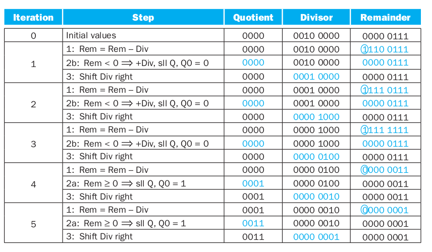

## Algoritmo de Divisão

Uma divisão é formada por dividendo (K), divisor (D), quociente (Q) e resto (R). Para implementar o algoritmo de divisão, a seguinte ideia será utilizada:

- Subtrair o divisor do MSB do dividendo, averiguar o sinal do resultado dessa divisão. Caso o sinal seja $\geq 0$, teremos que o MSB do quociente será 1. Caso contrário, o MSB do quociente será zero.

- Repetir o passo anterior, fazendo o shift à direita do dividendo.

  - Divisor(D) = 64 bits
  - Resto(R) = 64 bits
  - Quociente(Q) = 32 bits

### Algoritmo

1. Passo 1: `R = K; contador = 1`;
2. Passo 2: `R = R - D`
3. Passo 3: Desloque `Q` à esquerda.
    - Se $R\geq0$, `Q[0] = 1`;
    - Se $R<0$, restaure o valor original de R (`R += D`).
4. Passo 4: Desloque D à direita.
5. Passo 5: Se `contador < 33; contador++` e volte ao Passo 2.

<!-- ## Tabela

|Iteração|Descrição|Q|D|R|
|:-:|-|-|:-:|:-:|
|0|Inicialização|0000|0010 0000|0000 0111|
|1|sll Q, R=R-D srl D  add R, R, D|0000   0000   0000|0010 0000 0001 0000 0001 0000|$<0$   $<0$   0000 0111|
|2|sll Q, R=R-D srl D  add R, R, D|0000 0000   0000|0001 0000 0000 1000 0000 1000|$<0$   $<0$   0000 0111|
|3|sll Q, R=R-D srl D  add R, R, D|0000 0000   0000|0000 1000 0000 0100 0000 0100|$<0$   $<0$   0000 0111|
|4|sll Q, R=R-D srl D  `Q[0]=1`|0000 0000   0001|0000 0100 0000 0010 0000 0010|0000 0111   0000  0011   0000 0011|
|5|sll Q, R=R-D srl D  `Q[0]=1`|0000 0010   0011|0000 0010 0000 0001 0000 0001|0000 0011   0000 0001   0000 0001|

 -->

## Instruções no MIPS

Para efetuar divisões utiliza-se as intruções `div; divu` para divisão com e sem sinal, respectivamente.

- Sintaxe:
  - `div reg1, reg2`
  - `divu reg1, reg2`

Após a divisão o resto fica armazenado no registrador `hi` e o quociente no `lo`. Para recuperar os valores desses registradores utiliza-se as instruções move from (`mfhi; mflo`)

- Sintaxe:
  - `mfhi reg1 # reg1 = hi`
  - `mflo reg1 # reg1 = lo`

O resto sempre possui o mesmo sinal do dividendo. Por exemplo, em $7\div(-3)=-2$, temos resto 1 e em $-7\div3=-2$, resto -1.

\newpage

## Exemplo do Algoritmo

Exemplo do algoritmo de divisão, com registradores de 4 bits: $0111\div0010$

- Divisor (8 bits) $\rightarrow$ 0100 **0000**
- Resto (8 bits) $\rightarrow$ **0000** 0111

