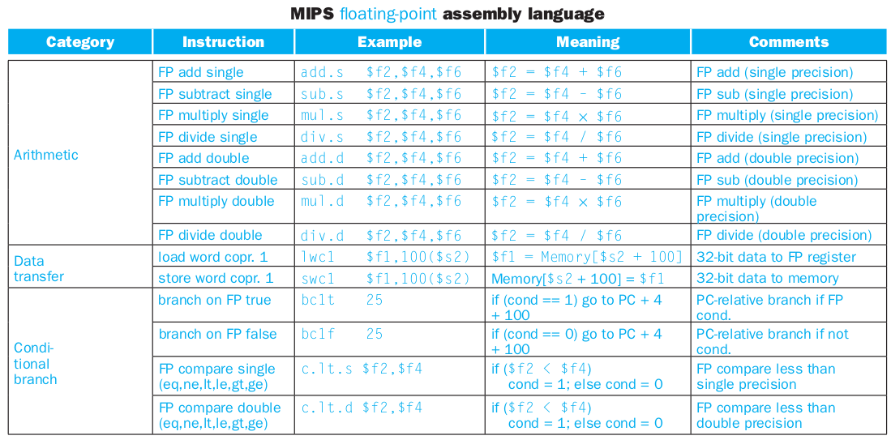

# Aula 6 - Aritmética em ponto flutuante

## Arredondamento

Na arquitetura MIPS define-se 4 tipos de arredondamento:

- Sempre para cima:
  - $2,11 \rightarrow 2,2$
  - $2,15 \rightarrow 2,2$
- Sempre para baixo:
  - $2,11 \rightarrow 2,1$
  - $2,15 \rightarrow 2,1$
- Truncamento:
  - $1,01101_2 \rightarrow  1,40625_{10}$
  - $1,011_2 \rightarrow  1,3725_{10}$
- Para o mais próximo:
  - $2,11 \rightarrow 2,1$
  - $2,19 \rightarrow 2,2$
  - Um critério para desempate quando o algarismo menos significativo é 5,
  arredonda-se para o número par mais próximo:
    - $2,15 \rightarrow 2,2$
    - $2,25 \rightarrow 2,2$

## Instruções no MIPS

O processador MIPS tem três coprocessadores, sendo o co-processador 1 reservado para o armazenamento de números em ponto flutuante. Este possui 32 registradores de uso geral: $f0 a $f31.

Não existem instruções imediatas para lidar com números em ponto flutuante, além disso, não é possível realizar operações entre registradores inteiros e reais utilizando as instruções MIPS, para tal é necessário armazenar o número inteiro em um registrador real, e então fazer a operação.

Para precisão dupla (double) utiliza-se os registradores de número par, por exemplo, usando o registrador $f2 em uma instrução, esta avaliará os valores armazenados em $f2 e $f3.

Para carregar constantes utilizamos a seção `.data`:

- `float f1, f2, f3, ..., fn`
- `double d1, d2, d3, ..., dn`

Além disso, existem `syscalls` utilizadas para ler e imprimir floats e doubles:

| Serviço | Código ($v0) |Argumento | Retorno|
| - | :-: | :-: |  :-: |
| Imprimir float | 2 | $f12 | - |
| Imprimir double | 3 |$f12 | - |
| Ler float | 6 |  -|$f0 |
| Ler double | 7 | -|$f0 |

As instruções para operar com ponto flutuante seguem o seguinte padrão:
<center>

`op.prec`
</center>

Onde `op` representa o mnemônico da operação e `prec`a precisão $\in$ {s,d}.



Acesso à memória:

- `l.s (ou l.d) $f0, 0($t2) # Carrega em $f0 o conteúdo armazenado em $t2+0`
- `s.s (ou s.d) $f0, 100($s0) # Escreve em $f0 o conteúdo armazenado em $s0+100`
- `mov.s (ou mov.d) $f0, $f2 #f0=f2`

> Obs: precisão simples ocupa 4 bytes na memória e precisão dupla, 8 bytes.

Exemplo: Suponha um vetor de ponto flutuante de precisão dupla com endereço base em `$s0` com endereço

O desvio condicional é feito em duas etapas:

- Comparação entre registradores, e o resultado é salvo em um registrador especial;
- Efetua o desvio baseado no valor do registrador especial.

### Comparação e desvio

|Instrução|Sintaxe|Significado|
|-|:-:|:-:|
|c.eq.s | c.eq.s $f2, $f4| =  |
|c.ne.s | c.ne.s $f2, $f4| != |
|c.le.s | c.le.s $f2, $f4| <= |
|c.lt.s | c.lt.s $f2, $f4| <  |
|c.ge.s | c.ge.s $f2, $f4| >= |
|c.gt.s | c.gt.s $f2, $f4| >  |
|c.eq.d | c.eq.d $f2, $f4| =  |
|c.ne.d | c.ne.d $f2, $f4| != |
|c.le.d | c.le.d $f2, $f4| <= |
|c.lt.d | c.lt.d $f2, $f4| <  |
|c.ge.d | c.ge.d $f2, $f4| >= |
|c.gt.d | c.gt.d $f2, $f4| >  |

- Desvio
  - `bc1f label` - branch coprocessor1 label 1 if false
  - `bc1t label` - branch coprocessor1 label 1 if true

Exemplo: Faça um programa para converter a escala de temperatura Fahrenheit para Celsius.

```c
    float f2c(float f){
        return (5.0/9.0)*(f-32.0);
    }
```

```assembly
    .data
    c5: .float 5.0
    c9: .float 9.0
    c32: .float 32.0
    nl: .asciiz "\n"
.text
    main:
    li $v0, 6 # cód. para ler float
    syscall # float lido está em $f0

    l.s $f1, c5 # salva o valor da constante c5 em $f1
    l.s $f2, c9 # salva o valor da constante c9 em $f2
    l.s $f3, c32 # salva o valor da constante c32 em $f3
    
    sub.s $f12, $f0, $f3 # f12 = F - 32
    mul.s $f12, $f12, $f1 # f12 = (F-32) * 5
    div.s $f12, $f12, $f2 # f12 = (F-32) * 5/9

    li $v0, 2 # código para imprimir float (em $f12) na tela
    syscall

    li $v0, 4 # código para imprimir string (em $a0) na tela
    la $a0, nl  # carrega o valor de nl em a0
    syscall

    li $v0, 10 # código para encerrar o programa
    syscall
```
