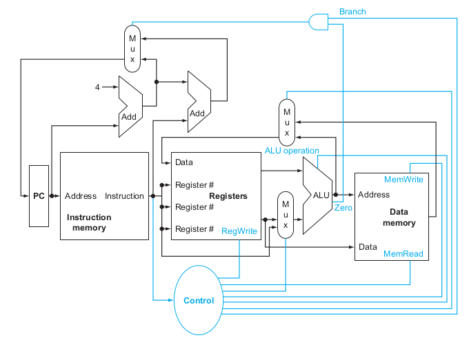

Analisaremos o seguinte subconjunto de instruções.

- lw, sw, sub, and, or, slt, beq e j;

## Execução de uma instrução

O ciclo de um processador é dividido em 3 etapas:

- Fetch: acessa a memória e busca a instrução a ser executada;
- Decode: decodifica a instrução e obtém os dados necessários para execução (acesso aos registradores);
- Execute: executa a instrução, dependendo da classe (R, I ou J) de instrução
  - Usa uma ULA para cálculos (instruções aritméticas, de acesso À memória e de desvio);
  - Faz acesso à memória;
  - PC recebe o destino do desvio ou PC + 4 (incremento de uma instrução - 4 bytes).

## Visão geral do CPU

- Nesta ULA estão implementadas as operações aritméticas, como multiplicação e adição.
- Um caminho de dados é o caminho percorrido por um número binário entre a entrada e a execução de instruções.
- As ligações entre os caminhos não podem se juntar diretamente, neste caso utiliza-se multiplexadores.

A unidade de controle, após a etapa de decode, faz a configuração das portas do caminho de dados a partir das particularidades da instrução a ser executada.

## Princípios do design lógico

- A informação sempre é codificada em bits, sendo que a voltagem baixa é representada por 0 e a alta por 1.

- Elementos combinacionais: são os elementos que operam com os dados e geram uma saída (ULA e MUXs).
- Elementos de estado: armazenam informação (memória de instrução, memória de dados e banco de registradores).

## Elementos sequenciais

Armazenam dados.

- Registrador armazena dados ao final de um ciclo de clock.
- Usa o sinal de clock para atualizar o valor que deve ser armazenado.
- Apenas duas das instruções consideradas não armazenam dados em registradores: `beq` e `sw`.

## Metodologia de clock

O tempo de ciclo de clock deve ser longo o suficiente para que uma instrução seja executada, independente do seu tipo. Na implementação monociclo a instrução mais demorada determina o tempo do clock, geralmente esta é a instrução de acesso à memória.

## Construindo um caminho de dados

A parte do caminho de dados responsável pela recuperação (fetch) das instruções e incremento do PC está representada na figura abaixo.

O endereço de 32 bits do PC entra na porta da memória de instruções. A memória de instruções pega a instrução armazenada no endereço apontado por PC e devolve a instrução na saída. Além disso, a saída do PC também é enviada para a ULA de adição, que incrementa 4 e realimenta o PC. Enquanto a instrução é recuperada do banco de instruções, o PC já é incrementado.

## Instruções do tipo R

Leem dois registradores operandos, fazem a operação lógica ou aritmética e escrevem o resultado num registrador.

|op|rs|rt|rd|shamt|funct|
|:-:|:-:|:-:|:-:|:-:|:-:|
|6 bits|5 bits|5 bits|5 bits|5 bits|6 bits|

- `rs`, `rt` são os operandos e `rd` é o destino.

Ao sair da memória de instruções, a instrução é decodificada na unidade de controle e configura o caminho de dados para que a instrução percorra o caminho de dados adequado.

- A unidade de controle parte dos 6 bits do campo `op` para determinar se a operação é do tipo R, I ou J.
- Quando a operação é do tipo R, a operação aritmética a ser executada está no campo `func`.
- Como a escrita será feita ao final do clock, o processador guarda o processador em que o resultado será escrito.
- Ao final do ciclo, o que estiver no Write Data será escrito no registrador RegWrite caso a flag RegWrite esteja ativada.
- A saída da ULA é ligada no WriteData (no caso da instruções do tipo R).
- A operação é determinada pela flag ALU Operation configurado pela controladora a partir dos campos `op` e `funct` da instrução.

## Instruções load e store

- São instruções do tipo I

Leem os registradores operandos, calculam o endereço de memória usando o offset (usa a ULA e também um extenso de sinal do offset).

- Load: lê da memória e escreve no registrador.
- Store: lê do registrador e escreve na memória.

|op|rs|rt|constant or address|
|:-:|:-:|:-:|:-:|
|6 bits|5 bits|5 bits|16 bits|

O load word possui três etapas e o store word possui 4.

`lw $s0, 0($t0)`

1. Lê o registrador $t0.
2. Calcula o offset: base + offset.
3. Acesso a memória (lw para leitura e sw para escrita).
4. Acesso a memória no caso de sw, para armazenar no registrador o valor lido.

A instrução sw injeta o address e o write data (calculado pela ULA). E a instrução lw injeta o address. O controle do que será efetuado (leitura ou escrita) é feito pelas flags MemWrite e MemRead.

## Instruções de desvio

Leem os registradores operandos, compara os operandos (usando a ULA) e calcula o endereço do destino.

|op|rs|rt|constant or address|
|:-:|:-:|:-:|:-:|
|6 bits|5 bits|5 bits|16 bits|

`beq $s0, $s1, label`

O label é um deslocamento relativo ao PC em quantidade de instruções.

Observe que a passagem é feita em quantidade de instruções pelo tamanho limitado de 16 bits para o label na instrução do tipo I.

Para calcular o endereço de destino após o branch, deve-se efetuar: `PC + 4 * label`, já que cada instrução tem 4 bytes.

1. Lê os registradores $s0 e $s1.
2. Compara os registradores por meio da subtração (`$s0 - $s1 == 0 => $s0 = $s1`). A ULA contém uma flag `zero` que aponta que o resultado de uma operação foi zero.  
3. (Enquanto calcula a comparação) Calcula o endereço de destino do desvio: PC + deslocamento * 4. A multiplicação é calculada por meio de um shift de 2 bits à esquerda.

## Compondo os elementos

O caminho de dados deve ser capaz de executar as três operações em um único ciclo de clock, o início do ciclo é marcado pelo começo da etapa de fetch e o final, pela escrita no banco de registradores.

- Cada elemento do caminho de dados faz uma operação por vez, por exemplo, uma ULA não faz uma subtração e uma adição ao mesmo tempo;
- Por esse motivo existem duas memórias: de dados e de instruções, já que não é possível fazer dois acessos a memória simultaneamente.

Segmentação lógica da memória

||| |
|-|:-:|-|
| Pilha   Heap (Dinâmico) |$\downarrow$   $\uparrow$
||Estáticos| |
||Texto| $\uparrow$ crescimento dos endereços |
||Reservado| 0 |

A Pilha e o Heap compartilham o mesmo segmento de memória.

