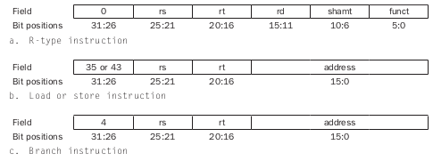

## Controle no caminho de dados

A controladora é a unidade que decide qual caminho uma instrução deve percorrer, a decisão é tomada baseada no campo op da instrução, os 6 primeiros bits da instrução. Essa unidade possui uma tabela verdade, implementada digitalmente, que faz a decisão do caminho a partir da tabela citada.

### Controle da ULA

A ULA é utilizada nos seguintes casos, com as respectivas operações:

- Instruções de load e store: operação add;
- Instruções de desvio: operação sub;
- Instruções do tipo R: operação depende do campo funct da instrução.

### Unidade de controle principal

Os sinais de controle derivam da instrução.

O primeiro campo é o opcode, o segundo é de leitura, o terceiro é de leitura (exceto para o load, onde é de escrita), o registrador rd e rt é de escrita para as instruções do tipo R e do tipo load.

A unidade controladora recebe o campo op da instrução [31-26] e a partir dele faz a configuração do caminho de dados com os sinais de controle. A unidade controladora da ULA recebe os campos [5-0] da instrução, que correspondem ao campo funct.

Os outros sinais da unidade de controle são:

Os campos MemRead e MemWrite determinam se no final do ciclo haverá escrita, leitura ou nenhuma operação na memória. É necessário utilizar dois sinais, já que existe a possibilidade de nenhuma operação na memória. Não é possível ter MemRead = MemWrite = 1, já que não é possível escrever e ler da memória ao mesmo tempo.

MemtoReg determina qual é o dado que será escrito na memória.

ALUSrc determina de onde vem o operador para a ULA, se vem do campo [15-0] constante ou do Read Data 2. Operações entre 2 registradores.

Valor dos sinais de controle para as operações.

Instruções do tipo R:

Instrução load:

Instrução beq:

## Problemas de desempenho

A instrução mais demorada determina o período de clock, que é a instrução load.

- Caminho crítico (instrução mais demorada): load;
- Caminho da instrução: memória de instrução $\rightarrow$ banco de registradores $\rightarrow$ ULA $\rightarrow$ memória de dados $\rightarrow$ banco de registradores;
- Outras instruções são executadas mais rapidamente, e para melhorar esse caminho utiliza-se pipeline.
