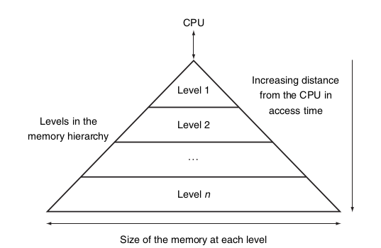

## Memória

Unidade persistente para armazenamento de dados de usuário e software.

- Acesso aos dados consome o maior tempo;
- Quanto mais rápido o acesso, mais cara a memória (preço monetário).

A memória trabalha de acordo com dois princípios de localidade:

- Temporal: um dado acessado tende a ser acessado novamente em breve;
- Espacial: se um dado foi acessado, dados próximos devem ser acessados em breve.

Esses princípios sugerem uma organização **hierárquica** da memória.

Os níveis hierárquicos são divididos de tal forma que:

- O custo-benefício seja o mesmo nos níveis
- A memória mais rápida fique mais próxima ao processador.

## Conceitos

- Os dados são mantidos no nível mais baixo e as cópias são feitas apenas entre níveis adjacentes;
- O processador acessa dados apenas do nível mais alto;
- Se um dado requisitado estiver no nível mais alto, dizemos que houve um acerto. Caso contrário, houve uma falha;
- Taxa de acerto (taxa de falha) é a fração de acessos que resultaram em acerto (falha);
- Tempo de acerto (penalidade de falha) é o tempo para acessar um dado quando houve acerto (falha).

## Tipos de memória

- SRAM (static random access memory): utilizada na memória cache e custa cerca de 5 mil dólares por gigabyte.
  - O dado permanece até ser removido ou sobrescrito;
  - Não é persistida.

- DRAM (dynamic random access memory): utilizada na memória RAM e custa cerca de 20 dólares por gigabyte
  - A memória precisa dinamicamente realimentar o próprio dado para permanecer armazenado;
  - Não é persistida.

- FLASH
  - A energia desgasta as unidades de memória;
  - Possui um sistema de espalhamento dos dados.
