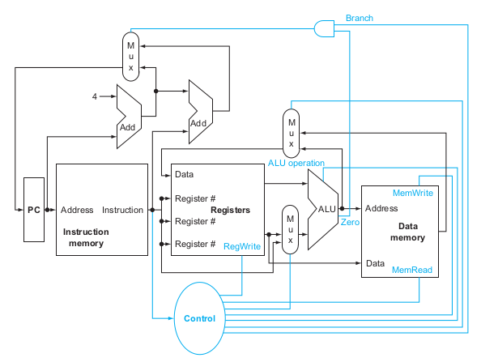

# Exercises

- 4.1 Consider the following instruction:
Instruction: AND Rd,Rs,Rt
Interpretation: Reg[Rd] = Reg[Rs] AND Reg[Rt]

Figure 4.2 

> 4.1.1 [5] <§4.1> What are the values of control signals generated by the control in Figure 4.2 for the above instruction?

RegWrite = 
Alu Operation = 10
MemRead = 
MemWrite = 
Branch = 0

> 4.1.2 [5] <§4.1> Which resources (blocks) perform a useful function for this instruction?

> 4.1.3 [10] <§4.1> Which resources (blocks) produce outputs, but their outputs are not used for this instruction? Which resources produce no outputs for this instruction?

- 4.2 The basic single-cycle MIPS implementation in Figure 4.2 can only implement
some instructions. New instructions can be added to an existing Instruction Set
Architecture (ISA), but the decision whether or not to do that depends, among
other things, on the cost and complexity the proposed addition introduces into the
processor datapath and control. The first three problems in this exercise refer to the
new instruction:
Instruction: LWI Rt,Rd(Rs)
Interpretation: Reg[Rt] = Mem[Reg[Rd]+Reg[Rs]]
4.2.1 [10] <§4.1> Which existing blocks (if any) can be used for this instruction?
4.2.2 [10] <§4.1> Which new functional blocks (if any) do we need for this
instruction?
4.2.3 [10] <§4.1> What new signals do we need (if any) from the control unit to
support this instruction?
